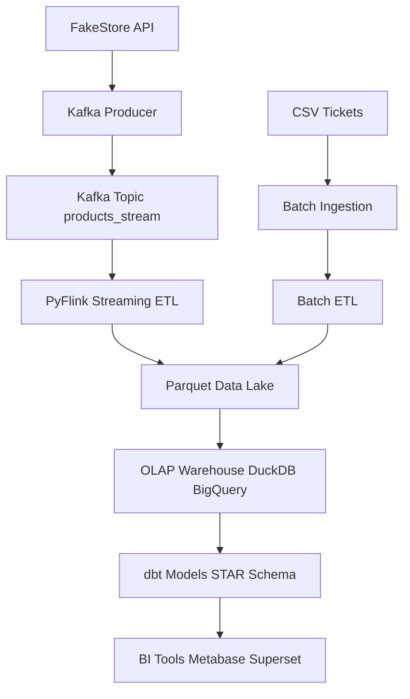
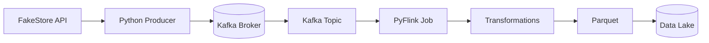
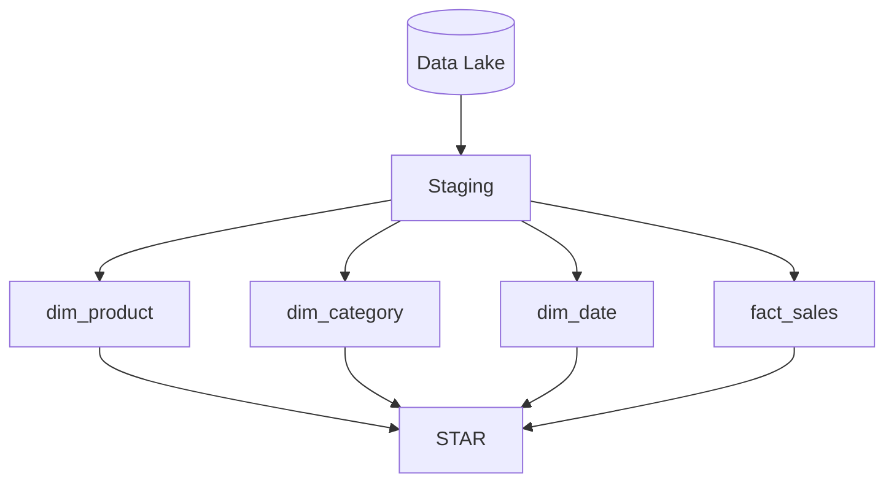
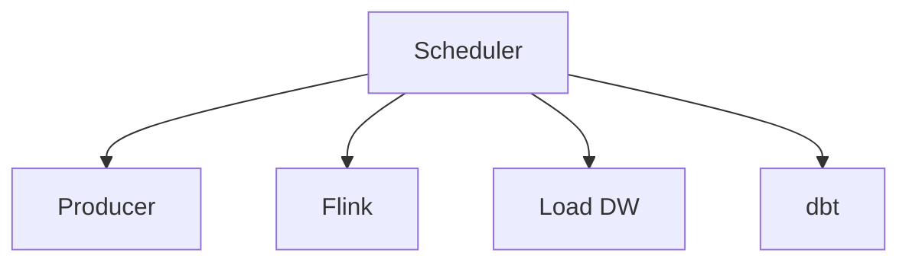

Project Overview: 

El proyecto consiste en el desarrollo de una plataforma de análisis en tiempo real para el seguimiento de tickets de servicio y órdenes de una tienda virtual (basada en la  **Fake Store API** ). El sistema integra flujos de datos continuos, procesa eventos en tiempo real, almacena registros históricos en la nube y proporciona herramientas de visualización avanzada para la toma de decisiones proactivas en la gestión de clientes y logística.

Problem Statement

**El Desafío:** Los sistemas tradicionales de atención al cliente a menudo operan con datos estáticos o reportes diarios, lo que genera cuellos de botella, tiempos de respuesta lentos ante incidentes críticos y una desconexión entre el inventario real y las reclamaciones de los usuarios.

Solución Propuesta:

* **Ingestión de API en Tiempo Real:** **Captura de datos de pedidos y tickets mediante productores de Kafka sincronizados con la Fake Store API.**
* **Procesamiento de Flujos:** **Uso de Spark Streaming y Kestra para identificar anomalías y tendencias en el comportamiento de los servicios al instante.**
* **Almacenamiento de Datos de Niveles:** **Implementación de una arquitectura de medallón (Bronze, Silver, Gold) para asegurar la integridad de los datos.**
* **Dashboards Dinámicos:** **Visualización de métricas clave (SLA, volumen de tickets, estados de envío) mediante Superset.**

Project Architecture Overview

La arquitectura se centra en un flujo de datos sin interrupciones, orquestado por contenedores **Docker** y gestionado por  **Kestra** . Los eventos de la Fake Store API son capturados por un productor, enviados a un tópico de Kafka y procesados a través de pipelines de Spark para su transformación y posterior análisis en BigQuery.

## 📌 Overview

Este proyecto implementa una arquitectura completa de Data Engineering combinando:

- Ingesta batch (CSV)
- Ingesta streaming (API → Kafka)
- Procesamiento en tiempo real (PyFlink)
- Data Warehouse OLAP
- Modelado dimensional (Kimball - Star Schema)
- Orquestación con Kestra

---

## 🧠 Arquitectura General



---

## ⚡ Streaming Architecture



---

## 🧱 Data Warehouse (Kimball)



---

## 🔄 Orquestación (Kestra)



---

## 🛠️ Stack

- Kafka
- PyFlink
- DuckDB / BigQuery
- dbt
- Kestra
- Pandas
- Superset

---

## 🚀 Cómo correr

```bash
docker-compose up -d
python producer.py
python flink_job.py
duckdb < duckdb_load.sql
dbt run
```

---

## 📈 Futuro

- Data Quality
- SCD Type 2
- Cloud deployment
- Dashboard BI

Data Flow

1. **Ingestión:** **Un contenedor de streaming extrae datos de la Fake Store API y los envía al tópico de Kafka** `service_ticket_data`.
2. **Procesamiento Batch/Stream:** **Pipeline orquestado por** **Kestra** **que consume datos de Kafka, los almacena como datos** **Bronze** **(raw) en** **Google Cloud Storage (GCS)** **y en una base de datos**  **PostgreSQL** **.**
3. **Transformación (Silver):** **Apache Spark** **procesa los datos de GCS, aplica esquemas OLAP (Star Schema) y los guarda nuevamente en GCS como datos** **Silver** **(transformados).**
4. **Exportación a BigQuery:** **Un pipeline carga los datos "Silver" desde GCS hacia** **BigQuery** **para facilitar el análisis a gran escala.**
5. **Refinamiento de Negocio (Gold):** **dbt Core** **transforma los datos en BigQuery hacia tablas**  **Gold** **, listas para el consumo de analítica avanzada y modelos de machine learning.**

Tech Stack Used

* **Docker:** **Containerización para aislamiento y portabilidad de todos los servicios.**
* **Apache Kafka:** **Plataforma de streaming distribuido para la ingesta de datos.**
* **Kestra ** **Orquestadores para la ejecución de flujos de trabajo y pipelines.**
* **Apache Spark:** **Motor de computación distribuida para procesamiento de datos a gran escala.**
* **dbt (Data Build Tool):** **Transformación de datos SQL para convertir datos crudos en insights.**
* **PostgreSQL:** **Base de datos relacional para almacenamiento operativo y metadatos.**
* **Superset:** **Herramienta de BI para creación de visualizaciones y dashboards.**
* **Google BigQuery & GCS:** **Infraestructura de almacenamiento y Data Warehouse en la nube (GCP).**
* **Terraform:** **Infraestructura como Código (IaC) para el aprovisionamiento de recursos.**

Pipeline Overview

1. **Batch Pipeline:** **Procesa datos históricos desde GCS, realiza transformaciones OLAP con Spark y los exporta a BigQuery.**
2. **Streaming Pipeline:** **Componente dinámico que procesa flujos continuos de la API en tiempo real usando Kafka y Kestra.**
3. **dbt Pipeline:** **Transforma los datos de nivel Silver en tablas Gold dentro de BigQuery, creando modelos de dimensiones y hechos.**
4. **Dockerized Services:** **Gestión de servicios de infraestructura (Broker de Kafka, Zookeeper, Spark Master/Workers, Jupyter, Metabase).**

Step-by-Step Execution Guide

Para ejecutar el proyecto, siga estos pasos tras clonar el repositorio:

1. **Inicialización de Infraestructura:**
   * **Configurar las credenciales de GCP en** `google-cred.json`.
   * **Ejecutar** `terraform-start` **para crear los buckets de GCS y datasets de BigQuery.**
2. **Levantamiento de Servicios:**
   * **Ejecutar** `docker-compose up -d` **para iniciar Kafka, Spark, Postgres y Metabase.**
3. **Activación del Ingestor:**
   * **Ejecutar el script productor:** `python producer_api.py` **para comenzar a poblar Kafka con datos de la Fake Store API.**
4. **Ejecución de Pipelines:**
   * **Acceder a la interfaz de Kestra/Mage para activar el flujo de ingesta y transformación.**
   * **Correr** `dbt run` **para generar las tablas Gold en BigQuery.**
5. **Visualización:**
   * **Conectar Metabase a BigQuery y cargar el archivo de configuración del dashboard predefinido.**

Deliverables

* **Infraestructura:** **Código de Terraform para el despliegue automático en GCP.**
* **Pipelines:** **Scripts de Spark (PySpark) y configuraciones de Kestra/Mage.**
* **Modelos de Datos:** **Repositorio dbt con modelos Gold documentados y testeados.**
* **Dashboard:** **Panel en Metabase con KPIs de Service Ticker (Ej: Tiempo medio de respuesta, Tickets por categoría).**
* **Documentación:** **Guía de depuración (Debug README) y especificación de la arquitectura.**

Additional Benefits

* **Modularidad:** **El diseño permite actualizar componentes individuales (ej. cambiar Spark por Flink) sin afectar el sistema completo.**
* **Costo-Eficiencia:** **Al usar GCS y BigQuery, solo se paga por el almacenamiento y las consultas realizadas.**
* **Escalabilidad Automática:** **La naturaleza distribuida de Kafka y Spark permite manejar incrementos súbitos en el volumen de datos de la API.**

Conclusion

Este proyecto demuestra una implementación robusta de ingeniería de datos moderna. Al integrar tecnologías de punta como Spark, Kafka y dbt bajo una arquitectura de medallón, se logra transformar datos crudos de una API en inteligencia de negocio accionable en tiempo real, garantizando escalabilidad, calidad y mantenibilidad.
