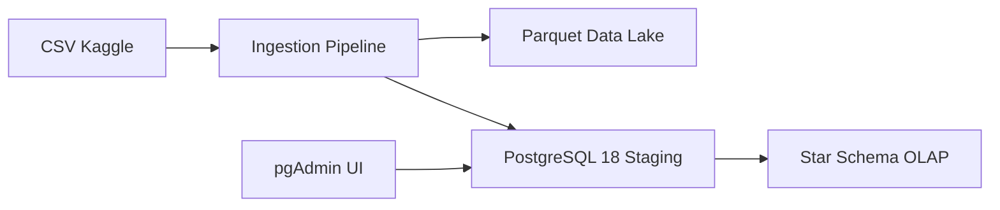

# Ì∫Ä Data Engineering Module 1 (Production Style)

## Ì∑† Architecture



## ⚙️ Stack

- Docker + Docker Compose
- PostgreSQL 18
- pgAdmin
- Python 3.13 + uv
- Pandas + PyArrow
- SQLAlchemy

## Ì∫Ä Quickstart

```bash
make up
make ingest
```

## ̺ê Access

- pgAdmin: http://localhost:8085  
- user: admin@admin.com  
- pass: root  

