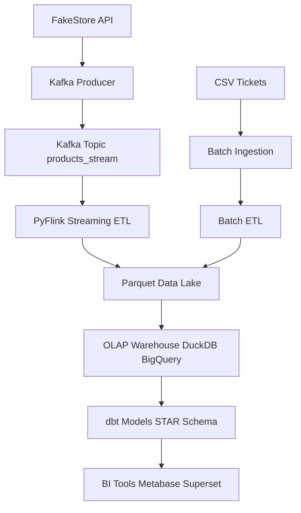
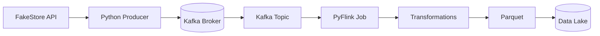
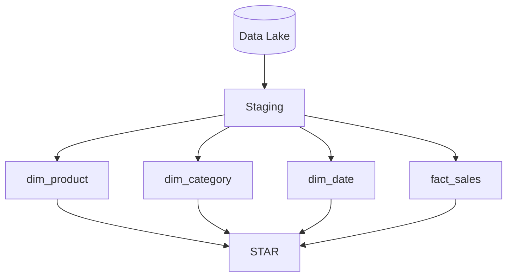
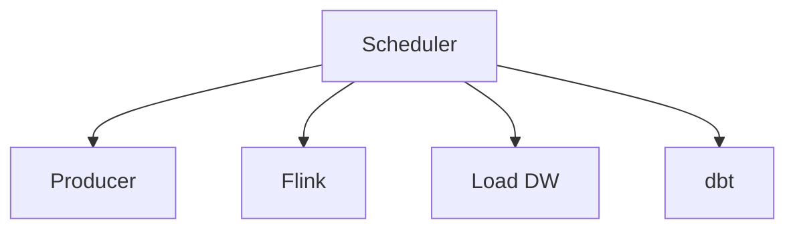

# 🚀 Data Engineering Project — Batch + Streaming + OLAP (Kimball)

## 📌 Overview

Este proyecto implementa una arquitectura completa de Data Engineering combinando:

- Ingesta batch (CSV)
- Ingesta streaming (API → Kafka)
- Procesamiento en tiempo real (PyFlink)
- Data Warehouse OLAP
- Modelado dimensional (Kimball - Star Schema)
- Orquestación con Kestra

---

## 🧠 Arquitectura General



---

## ⚡ Streaming Architecture



---

## 🧱 Data Warehouse (Kimball)



---

## 🔄 Orquestación (Kestra)



---

## 🛠️ Stack

- Kafka
- PyFlink
- DuckDB / BigQuery
- dbt
- Kestra
- Pandas
- Parquet

---

## 🚀 Cómo correr

```bash
docker-compose up -d
python producer.py
python flink_job.py
duckdb < duckdb_load.sql
dbt run
```

---

## 📈 Futuro

- Data Quality
- SCD Type 2
- Cloud deployment
- Dashboard BI

---

## 👨‍💻 Autor

N.G.
