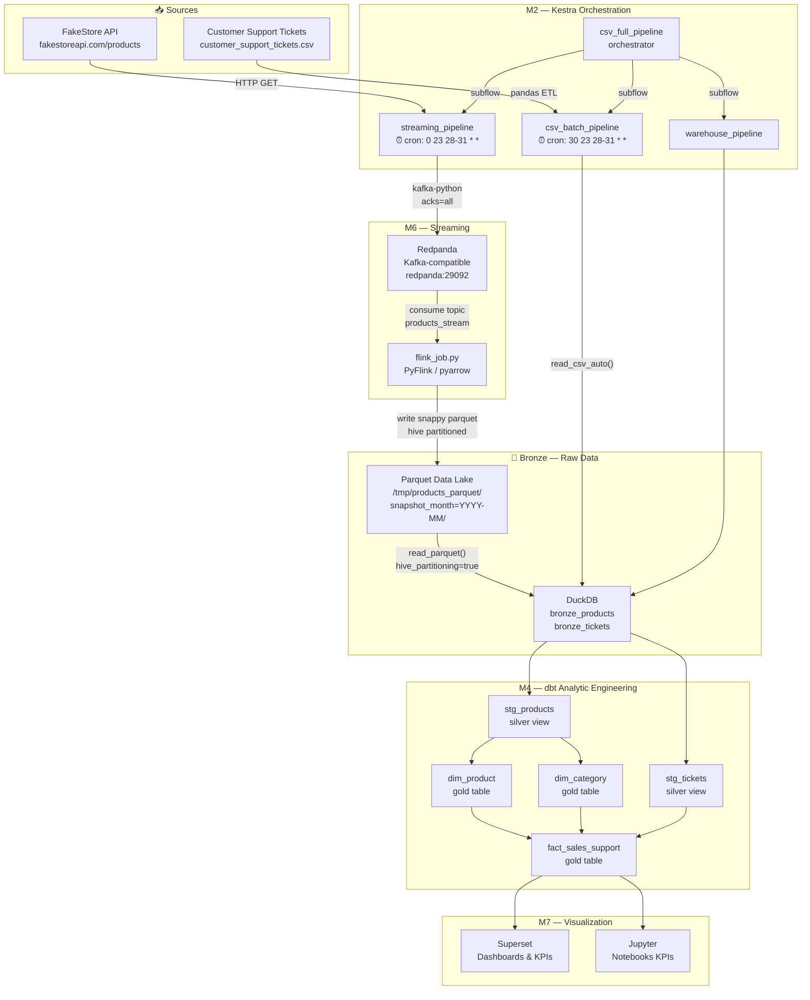
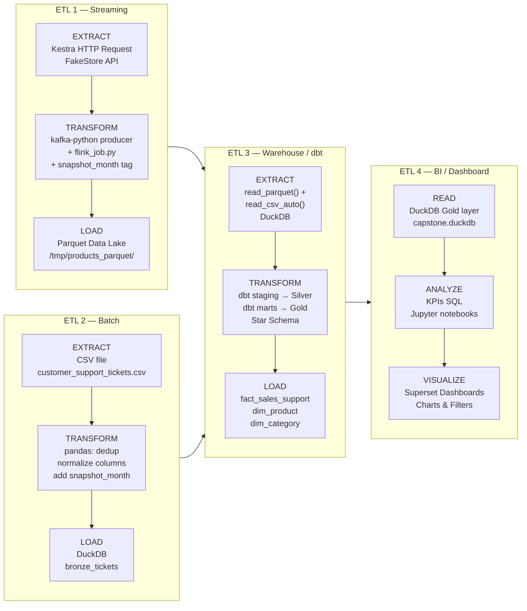
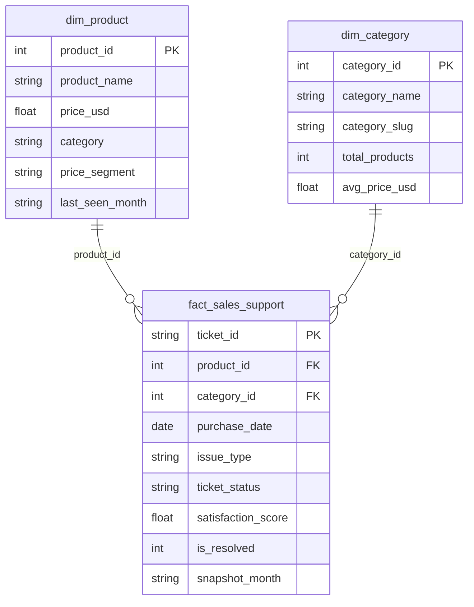
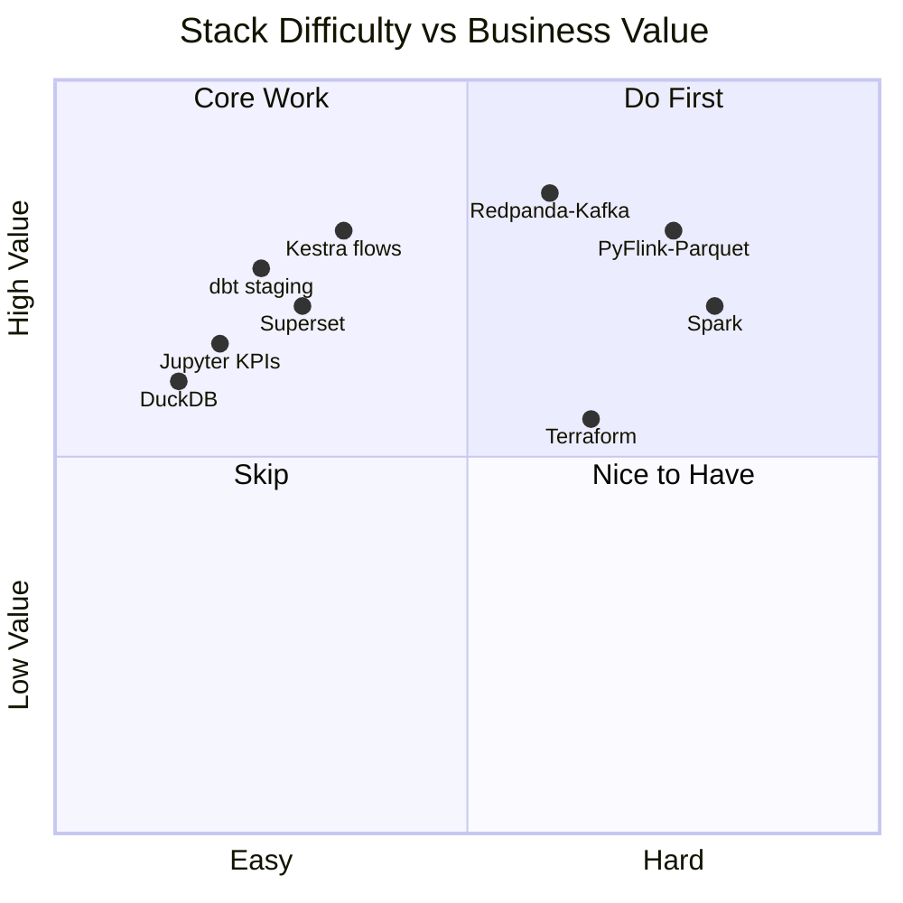

# Capstone Project DE1 — FakeStore API × Customer Support Tickets

> **Stack:** Docker · Terraform · Kestra · Redpanda · PyFlink · DuckDB · dbt · Spark · Superset · Jupyter

Two data sources, one Star Schema, end-to-end ETL pipeline.

---

## Quick Start

**Prerequisites:** `docker`, `docker compose`, `git`. Terraform optional.

```bash
# 1. Clone and enter the project
git clone https://github.com/ngribc/Capstone_ProjectDE1.git
cd Capstone_ProjectDE1

# 2. Copy your CSV to ./data/ and start the stack
cp /path/to/customer_support_tickets.csv ./data/
make up

# 3. Run the full pipeline
make pipeline-full
```

Open **Superset** at `http://localhost:8088` (admin / zoomcamp1234) and connect DuckDB:
```
duckdb:////shared/duckdb/capstone.duckdb
```

---

## ETL Architecture

### Full Data Flow



---

### ETL Breakdown — Which ETL did you build?



---

### Star Schema (Gold Layer)



---

### Difficulty Map



**Easiest path:** DuckDB → dbt → Superset (pure SQL, no infra)  
**Hardest path:** Redpanda → PyFlink → Parquet (distributed streaming)

---

## dbt Models — What Each File Does

### Staging (Silver layer — `materialized: view`)

**`stg_products.sql`**
- **What:** Reads `bronze_products`, casts `id` to INTEGER, `price` to DOUBLE, `LOWER(category)` for normalization, filters `price > 0` and `id IS NOT NULL`.
- **Why:** Raw API data has inconsistent types. This view guarantees clean types before any join downstream.

**`stg_tickets.sql`**
- **What:** Reads `bronze_tickets`, maps `product_purchased` (string) to a `product_id` (1–20) via `HASH % 20 + 1`, casts `customer_satisfaction_rating` to DOUBLE, casts `date_of_purchase` to DATE.
- **Why:** The CSV has no `product_id` column — the hash creates a deterministic FK that joins with `dim_product`. Without this, ETL2 and ETL1 would be siloed.

### Marts (Gold layer — `materialized: table`)

**`dim_product.sql`**
- **What:** `SELECT DISTINCT` from `stg_products`, adds `price_segment` (`economy / mid-range / premium`), takes `MAX(snapshot_month)` to get the latest version of each product.
- **Why:** Dimension table for OLAP. The `price_segment` column enables grouping by tier without SQL `CASE` in every dashboard query.

**`dim_category.sql`**
- **What:** Derives categories from `stg_products` using `GROUP BY category`. Adds `category_id` via `ROW_NUMBER()`, `category_slug` (spaces → underscores), `avg_price_usd` and `total_products` per category.
- **Why:** Superset can filter by category without scanning the fact table. Also pre-computes aggregates for KPI cards.

**`fact_sales_support.sql`**
- **What:** Central join — `stg_tickets JOIN dim_product ON product_id JOIN dim_category ON category`. Adds `is_resolved` (1/0 from ticket_status), `purchase_month` (truncated date), `price_segment` denormalized for OLAP performance.
- **Why:** This is the single table that answers all business questions. One row per ticket, enriched with product and category context. Joining two completely different data sources is the whole point of the capstone.

### Tests (`models/marts/schema.yml`)
- `dim_product.product_id` → `unique` + `not_null`
- `dim_category.category_id` → `unique` + `not_null`
- `fact_sales_support.product_id` → `relationships` to `dim_product`
- `fact_sales_support.category_id` → `relationships` to `dim_category`
- `dim_product.price_segment` → `accepted_values: [economy, mid-range, premium]`

---

## Project Structure

```
Capstone_ProjectDE1/
├── Makefile                          # All commands — run: make help
├── docker-compose.yml                # Full stack: Kestra·Redpanda·dbt·Spark·Jupyter·Superset
├── .env                              # Credentials (generated by terraform or setup)
├── .env.example                      # Template to copy
├── .gitignore
│
├── terraform/                        # M0: Infrastructure as Code
│   ├── main.tf                       # Docker network + volumes + .env generation
│   ├── variables.tf                  # All configurable params (ports, passwords)
│   ├── outputs.tf                    # URLs, resource names after apply
│   └── terraform.tfvars.example      # Copy to terraform.tfvars
│
├── M1_Infraestructure/               # Postgres + pgAdmin (standalone module)
│
├── M2_Orchestration/kestra/
│   └── flows/                        # Kestra flow YMLs
│       ├── streaming_pipeline.yml    # API → Kafka → Parquet (cron: end of month)
│       ├── csv_batch_pipeline.yml    # CSV → DuckDB bronze (cron: end of month +30m)
│       ├── warehouse_pipeline.yml    # Parquet+CSV → DuckDB → dbt run → dbt test
│       └── csv_full_pipeline.yml     # Orchestrator: runs all 3 above in sequence
│
├── M3_DataWarehouse/
│   └── duckdb/
│       └── capstone.duckdb           # Shared file: Kestra writes, dbt transforms, Jupyter reads
│
├── M4_AnalyticsEngineering/
│   └── dbt/
│       ├── Dockerfile                # python:3.11-slim + dbt-duckdb
│       ├── profiles.yml              # target: /shared/duckdb/capstone.duckdb
│       └── capstone_bi/
│           ├── dbt_project.yml       # staging=silver(view), marts=gold(table)
│           └── models/
│               ├── staging/
│               │   ├── sources.yml   # Declares bronze_products, bronze_tickets
│               │   ├── stg_products.sql
│               │   └── stg_tickets.sql
│               └── marts/
│                   ├── schema.yml    # All dbt tests (unique, not_null, relationships)
│                   ├── dim_product.sql
│                   ├── dim_category.sql
│                   └── fact_sales_support.sql
│
├── M5_Batch/
│   ├── notebooks/                    # Jupyter KPI analysis
│   └── spark/                        # Spark job scripts
│
├── M6_Streaming/
│   └── scripts/
│       └── flink_job.py              # Kafka consumer → Parquet writer (pyarrow)
│
├── M7_Visualization/                 # Superset config / exported dashboards
│
└── data/
    └── customer_support_tickets.csv  # ← Copy here before make up
```

---

## Common Commands

```bash
make help              # All available targets
make check             # Verify prerequisites
make up                # Start full stack
make ps                # Container status
make logs              # Live logs

make pipeline-full     # End-to-end ETL in one command
make kestra-trigger    # Trigger a flow  [FLOW=streaming_pipeline]
make dbt-run           # Run all dbt models  [MODEL=dim_product]
make dbt-test          # Data quality tests
make dbt-docs          # Docs at http://localhost:8081

make reset-duckdb      # ⚠️  Wipe DuckDB
make down              # Stop everything
```

---

## Ports

| Service | URL | Credentials |
|---------|-----|-------------|
| Kestra | http://localhost:18080 | admin@kestra.io / Admin1234 |
| Jupyter | http://localhost:8888 | token: zoomcamp |
| Superset | http://localhost:8088 | admin / zoomcamp1234 |
| Spark UI | http://localhost:8080 | — |
| Redpanda | localhost:9092 (Kafka) | — |
